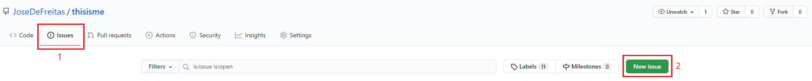
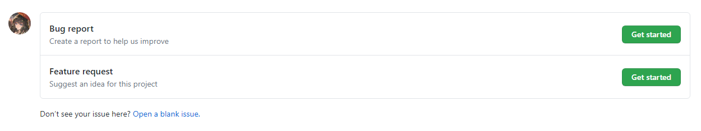
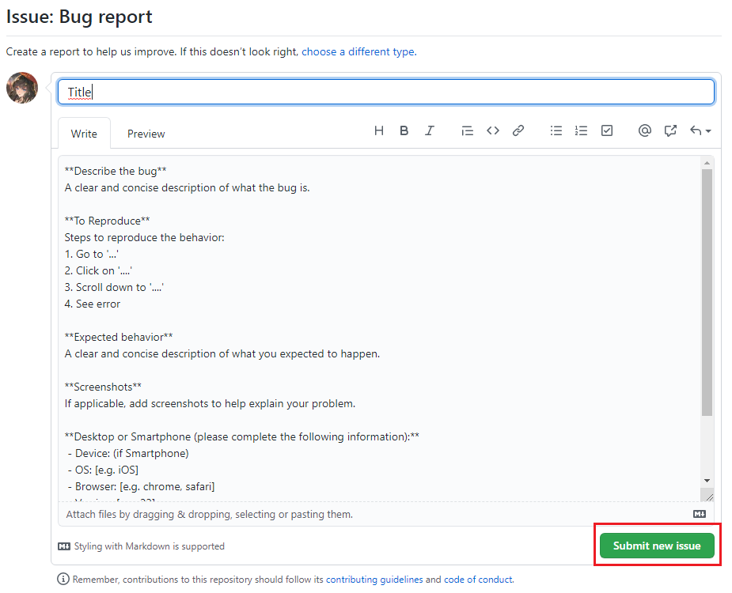
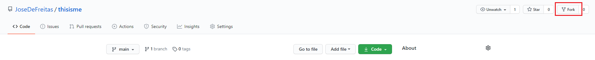
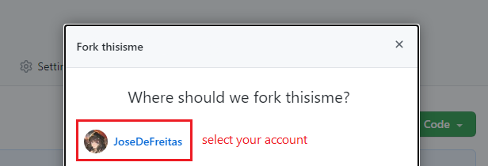
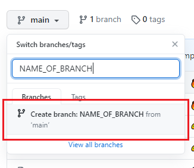
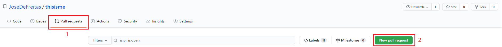
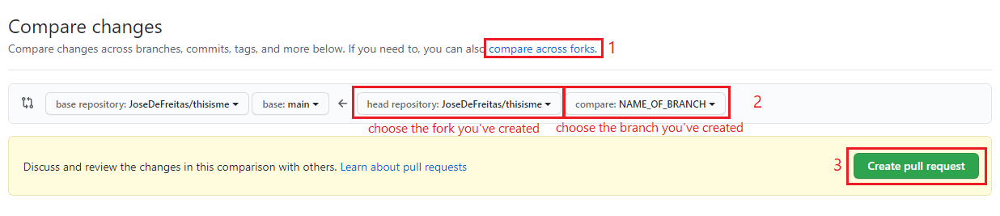
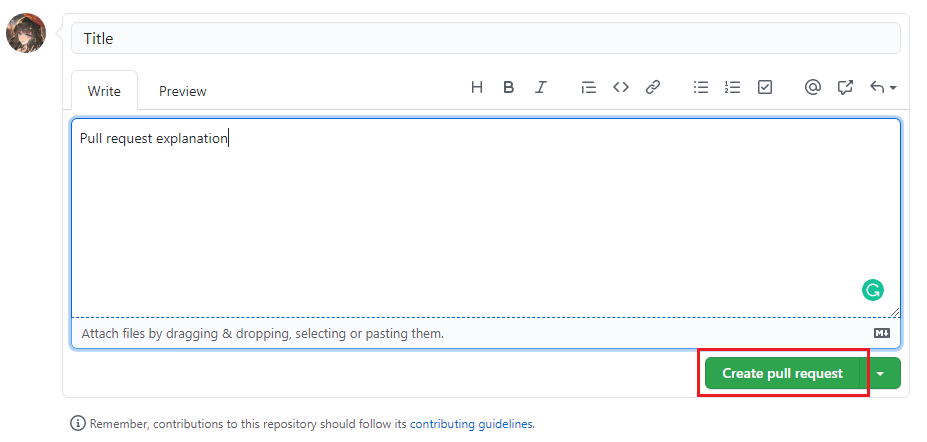

# Contributing**R

**Ready for the Hacktoberfest 2020! See the [Issues](https://github.com/JoseDeFreitas/thisisme/issues)**

## Code of conduct

There's the [code of conduct](https://github.com/JoseDeFreitas/thisisme/blob/main/code-of-conduct.md), which is a file that stores the rules and guidelines you must follow when interacting with the repository in any way. These rules are meant to be the main rules, and serve accordingly to preserve a good community between the users of it, as well as other users. Please, *read it carefully before contributing*.

## Easy for new contributors

This repository works perfectly for people who want to start contributing to open source projects (**first-time contributors!**). It has everything setted up properly with tutorials to let you know how you can achieve that perfect contribution you want to do. By contributing, you gain and reinforce your git skills: interacting with the GitHub website, GitHub cli, git commands and Issues & Pull requests system. Apart from that, when you make your first contribution that is approved, you are automatically added to the "Contributors" section (in the repository, as well as in the [thisisme website](https://thisisme.vercel.app).)

You don't know how to start? Read this quick guide to learn how:

  
Guide for first-time contributors

  <h3>Opening an issue:</h3>
  <h5>Please, read the whole document to know when to open an issue.</h5>
  <ol>
    <li>Go to the <a href="https://github.com/JoseDeFreitas/thisisme/issues">Issues section</a> and click on the "New issue" button. </li>
    <li>Choose an Issue template and follow along. If you don't see any template that matches your request, just click on "<a href="https://github.com/JoseDeFreitas/thisisme/issues/new">Open a blank issue</a>". </li>
    <li>Select an Issue title that corresponds to the content of the issue.</li>
    <li>Explain you issue! You can make use of the markdown system to make it look great.</li>
    <li>When ready, click on the "Submit new issue" button and... you've finished! </li>
  </ol>
  
You can go to the <a href="https://github.com/JoseDeFreitas/thisisme/issues">Issues section</a> to see examples of issues. Those with the "<a href="https://github.com/JoseDeFreitas/thisisme/labels/good%20first%20issue">good first issue</a>" label are good examples you can follow.

  <h3>Creating a pull request:</h3>
  <h5>Please, read the whole document to know when to open a pull request.</h5>
  <ol>
    <li>Fork the repository. <em>If you're in an organization, you may want to fork it just in your own account</em>.  </li>
    <li>Create a new branch in the fork you've created. Name it accordingly to the thing you'll add/delete/edit.  When using the command line, type: <code>git checkout -b "NAME_OF_BRANCH"</code>. This will create a branch called that name and switching you to it directly.</li>
    <li>Work on the thing you want to <strong>in the branch you've just created</strong>. You may only want to work in the <a href="https://github.com/JoseDeFreitas/thisisme/tree/main/src">src folder</a> or any document file. Please be carefull about what you edit.</li>
    <li>Stage the changes, commit them and (optionally) push them. If you're not working remotely, you may not need to push the changes. If you're using the command line, do this: <code>git add .</code> - to add to stage all the files you edited. <code>git commit -m "TITLE OF YOUR COMMIT"</code> - to commit your changes. Add a comment according to the changes you made. If you want to add aditional comments, do: <code>git commit -m "TITLE OF YOUR COMMIT" -m "ADDITIONAL COMMENTS"</code>. <code>git push</code> - to push your changes to the branch you've created (if you're working remotely.)</li>
    <li>Go to the <a href="https://github.com/JoseDeFreitas/thisisme/pulls">thisisme repository Pull requests section</a> and click on the "New pull request" button. After that, click on "compare across folks", select the fork you've created and the branch you've created in the fork using the third (repository) and the fourth (branch) inputs (the ones that are on the right-hand side of the arrow ("<-") icon). Then, click on "Create pull request".  </li>
    <li>Select a Pull request title that corresponds to the content of the pull request.</li>
    <li>Make a detailed explanation of the changes you've made. You can make use of the markdown system to make it look great.</li>
    <li>It's recommended that you keep the "Allow edits from maintainers" (or, it may also be "Allow edits and access to secrets by maintainers") checkbox <strong>checked</strong>. This way, users with write access can make changes and commit to your pull request, if needed. <em>You can change this option anytime after you've created the pull request though</em>.</li>
    <li>When ready, click on the "Create pull request" button and... you've finished! <em>The pull request needs to pass the Vercel check. You don't need to do anything, just close the page and it will automatically function</em>. </li>
  </ol>

## What and where to contribute?

You can contribute doing a lot of things! Have you come up with a new section/card that think it's worth adding? Have you found any typo? Do you want to change something about the design? The scripts are too complicated, and you know for sure you can help optimizing them? You've though about a new feature in general or a new page on the website? Do you think something is just incorrect? Have you found a bug? **Contribute!** There's a lot more things you can help with, though, don't think you must limit to the stuff there is: you can recommend using new technologies, changing the design, or any other thing. **Contribute!**

*Don't feel ashamed or embarrased when proposing new code, features or just pointing out an idea. Even if you think it's a dumb idea or a very basic or small feature, it helps a lot to grow the project and make the website function better than ever*.

## Issue or Pull request?

You may be wondering if creating an issue or a pull request. First of all, if you're new to GitHub or you just aren't very sure about what you know about issues and pull requests, I suggest reading this documents (from GitHub) to let you understand these systems better: [Collaborating with Issues and Pull requests](https://docs.github.com/en/github/collaborating-with-issues-and-pull-requests) and [Managing your work on GitHub](https://docs.github.com/en/github/managing-your-work-on-github).

So, issue or pull request? If you want to work in a new feature (that is not so big), and you can do it by yourself, without affecting the repository or the website, you can just fork the repository, create a new branch and working in that branch that feature you want to work in. When it's ready, just open a pull request. It has to pass the Vercel check, and it will be reviewed. Do this if you want to work on a new feature, fix something, add something, and related. Issues are a bit different. If you don't want to work directly (just want to point out there's a bug or something kind of) you can aswell open an issue. Issues are better pointed to be a place where users can chat and discuss about a feature some user recommended. In the issues, you can also find future ideas or other information. Anyway, issue or pull request, **you're contributing!**.

*To learn how to contribute by opening an issue or a pull request, see the "Guide for first-time contributors" in the [Easy for new contributors](#easy-for-new-contributors). Not works only for new contributors: it's a guide to contribute in the repository. It explains how to fork, create branches and stuff like that. May not be necessary for people who have contributed in any repository back in the past.*
